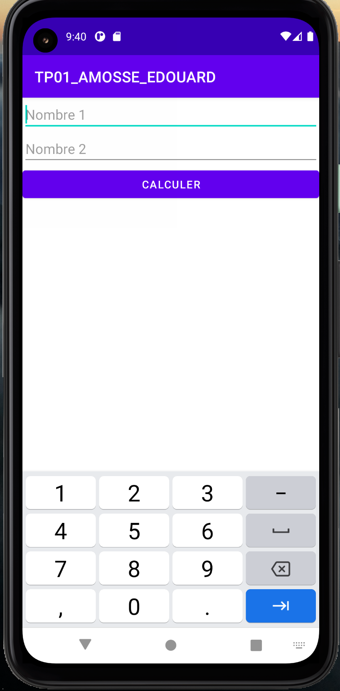
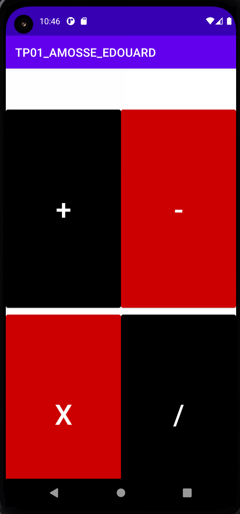
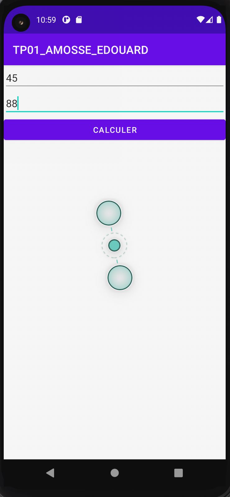
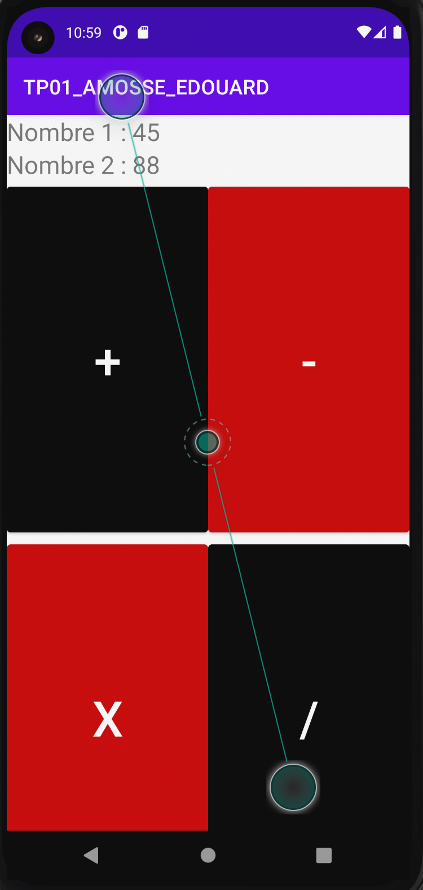

# Les activités et les intentions 
Dans ce TP, nous allons expérimenté les activités et les intentions dans le but de créer une application permettant d'entrer une opération math"matique dans une activité A d'effectuer le calcul dans une activité B.

> Dans une application Android, une activité est le composant qui gère l'interface présentée à l'utilisateur.

> La création ainsi que la gestion du cycle de vie d'une activité sont traitées intégralement par le système d'exploitation Android. Ainsi, le developpeur ne peut pas créer implicitement une activité, ni la détruire; c'est du ressort du systme d'exploitation. Les activités sont créées via des intentions. 

## 1. Créer une application
- Créez un nouveau projet : TPO2_NOM_PRENOM

> Assurez-vous d'avoir selectionné Java dans l'option language

- Suivez les instructions pour compléter la création du projet 

- Choisissez le template **Empty Activity**

- Laissez le nom de l'activité (MainActivity) ainsi que le layout (main_activity)

- Utilisez votre email (inversé) comme nom de package

- Compilez le projet


## 2. Modifiez la vue (activity_main)
- Allez dans le dossier **res > layout** puis cliquez sur le fichier **activity_main**
- Remplacez le text (Hello world!) par :
    - Deux champs de textes 
    - Un bouton

```xml
<?xml version="1.0" encoding="utf-8"?>
<androidx.constraintlayout.widget.ConstraintLayout xmlns:android="http://schemas.android.com/apk/res/android"
    xmlns:app="http://schemas.android.com/apk/res-auto"
    xmlns:tools="http://schemas.android.com/tools"
    android:layout_width="match_parent"
    android:layout_height="match_parent"
    tools:context=".MainActivity">

    <EditText
        android:id="@+id/nb1"
        android:layout_width="match_parent"
        android:layout_height="wrap_content"
        android:hint="Nombre 1"
        android:inputType="number"
        app:layout_constraintEnd_toEndOf="parent"
        app:layout_constraintStart_toStartOf="parent"
        app:layout_constraintTop_toTopOf="parent" />

    <EditText
        android:id="@+id/nb2"
        android:layout_width="match_parent"
        android:layout_height="wrap_content"
        android:hint="Nombre 2"
        android:inputType="number"
        app:layout_constraintEnd_toEndOf="parent"
        app:layout_constraintStart_toStartOf="parent"
        app:layout_constraintTop_toBottomOf="@+id/nb1" />

    <Button
        android:layout_width="match_parent"
        android:layout_height="wrap_content"
        android:text="Calculer"
        app:layout_constraintEnd_toEndOf="parent"
        app:layout_constraintStart_toStartOf="parent"
        app:layout_constraintTop_toBottomOf="@id/nb2" />

</androidx.constraintlayout.widget.ConstraintLayout>
```

- Compilez et exécutez



## 3. Traitez les actions 
On va modifier le code de l'activité afin de récupérer l'instance des vues du layout 

- Modifiez la classe de l'activité pour y ajouter des variables qui représentent les instances des vues du layout
    - 
  **Button** dans la classe **MainActivity**
```Java
    public class MainActivity extends AppCompatActivity {
    
    private EditText editTextNb1;
    private EditText editTextNb2;
    private Button buttonCompute;

    ...
}
```

- Ajoutez une méthode permettant d'instancier les variables

```Java
   /**
     * Methods that allow to retrieve the instance of views in the layout
     */
    private void initViews() {
        editTextNb1 = findViewById(R.id.nb1);
        editTextNb2 = findViewById(R.id.nb2);
        buttonCompute = findViewById(R.id.compute);
    }
}
```
> La méthode ```findViewById``` permet de récupérer l'instance d'un élément de vue connaissant son id.

- Appelez la méthode ```initViews``` dans l'activité. 
> Où faut-il appeler cette méthode? 


- Interceptez l'événement click du bouton. 
Modifiez la méthode ```initViews``` pour intercepter le clique de l'utilisateur. En effet, quand un utilisateur intéragit avec un élément de vue, le système notifie l'application. 
Pour intercepter ces actions, le SDK propose un ensemble de méthodes permettant à l'application d'intercepter ces évènements. 

```Java
    // Intercept click on the compute button
    buttonCompute.setOnClickListener(new View.OnClickListener() {
        @Override
        public void onClick(View view) {
            Toast.makeText(MainActivity.this, "Click", Toast.LENGTH_SHORT).show();
        }
    });

```

> Un toast est un message qui apparait tout en bas de l'écran et disparait automatiquement au bout de quelques secondes. 

- Exécutez le projet, puis cliquez sur le bouton.

> Que remarquez-vous ? 

### Récupérer les textes des champs
Modifiez la méthode ```initViews``` pour récupérer les textes des deux champs et les afficher dans le toast. 

```Java
// Get the contents of the input texts 
String textNb1 = editTextNb1.getText().toString();
String textNb2 = editTextNb2.getText().toString();

//Show a toast 
```Tu veux calculer la somme de 34 et 45 -> 34 et 45 sont les valeurs des deux champs nb1 et nb2 respectivement```
```
> La méthode ```getText()``` permet de récupérer le contenu d'un champ de texte. 

> Saurez-vous où placer les deux instructions précédentes ? 


## 4. Créer une seconde activity (ComputeActivity)

- Faites bouton droit sur le package du projet et cliquez sur ```New > Java Class```

- Appelez la classe ```ComputeActivity```

- Modifiez la classe pour qu'elle étende ```AppCompatActivity```

- Ajoutez un layout modélisant l'interface de l'activity ```ComputeActivity```
> Appelez le layout ```activity_compute```

```xml
<?xml version="1.0" encoding="utf-8"?>
<androidx.constraintlayout.widget.ConstraintLayout xmlns:android="http://schemas.android.com/apk/res/android"
    xmlns:app="http://schemas.android.com/apk/res-auto"
    xmlns:tools="http://schemas.android.com/tools"
    android:layout_width="match_parent"
    android:layout_height="match_parent"
    tools:context=".ComputeActivity">

    <TextView
        android:id="@+id/textNb1"
        android:layout_width="wrap_content"
        android:layout_height="wrap_content"
        app:layout_constraintStart_toStartOf="parent"
        app:layout_constraintTop_toTopOf="parent"
        android:textSize="24sp"
        tools:text="Nombre 1: 23" />

    <TextView
        android:id="@+id/textNb2"
        android:layout_width="wrap_content"
        android:layout_height="wrap_content"
        android:textSize="24sp"
        app:layout_constraintStart_toStartOf="parent"
        app:layout_constraintTop_toBottomOf="@id/textNb1"
        tools:text="Nombre 2: 45" />

    <Button
        android:id="@+id/sum"
        android:layout_width="0dp"
        android:layout_height="0dp"
        android:backgroundTint="@android:color/black"
        android:text="+"
        android:textSize="48sp"
        app:layout_constraintHeight_percent="0.5"
        app:layout_constraintStart_toStartOf="parent"
        app:layout_constraintTop_toBottomOf="@+id/textNb2"
        app:layout_constraintWidth_percent="0.5" />

    <Button
        android:id="@+id/minus"
        android:layout_width="0dp"
        android:layout_height="0dp"
        android:backgroundTint="@android:color/holo_red_dark"
        android:text="-"
        android:textSize="48sp"
        app:layout_constraintEnd_toEndOf="parent"
        app:layout_constraintHeight_percent="0.5"
        app:layout_constraintStart_toEndOf="@+id/sum"
        app:layout_constraintTop_toTopOf="@id/sum"
        app:layout_constraintWidth_percent="0.5" />

    <Button
        android:id="@+id/multiply"
        android:layout_width="0dp"
        android:layout_height="0dp"
        android:backgroundTint="@android:color/holo_red_dark"
        android:text="x"
        android:textSize="48sp"
        app:layout_constraintHeight_percent="0.5"
        app:layout_constraintStart_toStartOf="parent"
        app:layout_constraintTop_toBottomOf="@id/sum"
        app:layout_constraintWidth_percent="0.5" />

    <Button
        android:id="@+id/divide"
        android:layout_width="0dp"
        android:layout_height="0dp"
        android:backgroundTint="@android:color/black"
        android:text="/"
        android:textSize="48sp"
        app:layout_constraintEnd_toEndOf="parent"
        app:layout_constraintHeight_percent="0.5"
        app:layout_constraintStart_toEndOf="@+id/multiply"
        app:layout_constraintTop_toBottomOf="@id/sum"
        app:layout_constraintWidth_percent="0.5" />


</androidx.constraintlayout.widget.ConstraintLayout>

```


- Surchagez la méthode ```onCreate```` pour associer le layout à l'activité 

```Java
@Override
protected void onCreate(Bundle savedInstanceState) {
    super.onCreate(savedInstanceState);
    setContentView(R.layout.activity_compute);
}
```

## 5. Lancez l'activité 
Dans cette section, nous allons modifier l'ativité ```MainActivity``` pour lancer l'activité ```ComputeActivity``` quand l'utilisateur clique sur le bouton compute. 

- Modifiez l'action du clique pour lancer l'activité ```ComputeActivity```

```Java
...
Intent intent = new Intent(MainActivity.this, ComputeActivity.class);
startActivity(intent);
```

- Compilez et exécutez


- Modifiez l'intent pour envoyer les données entrées par l'utilisateur dans l'activité ```MainActivity``` à l'activité ```ComputeActivity```

```Java
Intent intent = new Intent(MainActivity.this, ComputeActivity.class);
intent.putExtra("nb1", textNb1);
intent.putExtra("nb2", textNb2);
startActivity(intent);
```

- Modifiez l'activity ```ComputeActivity``` pour récupérer les données envoyées dans l'intent 

```Java

private void setUpViews() {
    ......
    Intent intent = getIntent();
    String nb1 = intent.getStringExtra("nb1");
    String nb2 = intent.getStringExtra("nb2");

    textViewNb1.setText("Nombre 1 : "+ nb1);
    textViewNb2.setText("Nombre 2 : "+ nb2);
    }

```

- Compilez et exécutez




- Intercepter les événements sur les boutons : sum, minus, divide, multiply et effectuez l'opération correspondante sur les deux nombres passés en paramtres. 

> Attention à la division par zéro 


- Retournez le résultat de l'opération à l'activité ```MainActivity```
Modifiez la méthode ```initViews``` de ```ComputeActivity``` pour retourner le résultat de l'opération ainsi que son type, puis fermer l'activitté. 

```Java
...
buttonSum.setOnClickListener(new View.OnClickListener() {
@Override
public void onClick(View view) {
    int result = Integer.parseInt(nb1) + Integer.parseInt(nb2);
    Intent intent = new Intent();
    intent.putExtra("result", result);
    setResult(RESULT_OK, intent);
    finish();
}
});
....
```

- Modifiez l'activité ```MainActivity``` pour afficher le résultat de l'opération à la fermeture de l'activité ```ComputeActivity```.
```Java
.....
startActivityForResult(intent, COMPUTE_CODE);
.....

protected void onActivityResult(int requestCode, int resultCode, Intent data) {
super.onActivityResult(requestCode, resultCode, data);
if (resultCode == RESULT_OK) {
    if (requestCode == COMPUTE_CODE && data != null) {
        int result = data.getIntExtra("result", -1);
        Toast.makeText(this, "Result is " + result, Toast.LENGTH_SHORT).show();
    }
}
}
```


## 6. Exercice
Il y a pas mal de failles dans ce TP, il vous revient de les trouver puis les fixer. En voici quelques unes : 

- Risque d'erreurs dans les noms des clefs utilisés pour échanger des données entre les activités. Il serait mieux de déclarer toutes ses clefs dans une classe ```Constant```, par exemple. 

- Risques de crash dans l'activité ```Compute``` si l'utilisateur clique sur le bouton sans entrer de nombres. Faire en sorte de ne pas lancer l'activité ```Compute``` si les deux champs ne sont pas remplis.
Vous pouvez : 
    - Désactivé le bouton tant que les deux champs ne sont pas remplis. Pour cela, utiliser la méthode ```addTextChangedListener``` sur chaque champ de texte pour monitorer les modifications.     
    - Afficher un toast avec un message d'erreurs quand un champ est vide. 
    - Vous pouvez aussi afficher un icone d'erreurs directement dans le champ qui contient l'erreur 
    ``` Java
    editTextNb1.setError("Champ obligatoire");
    ```
