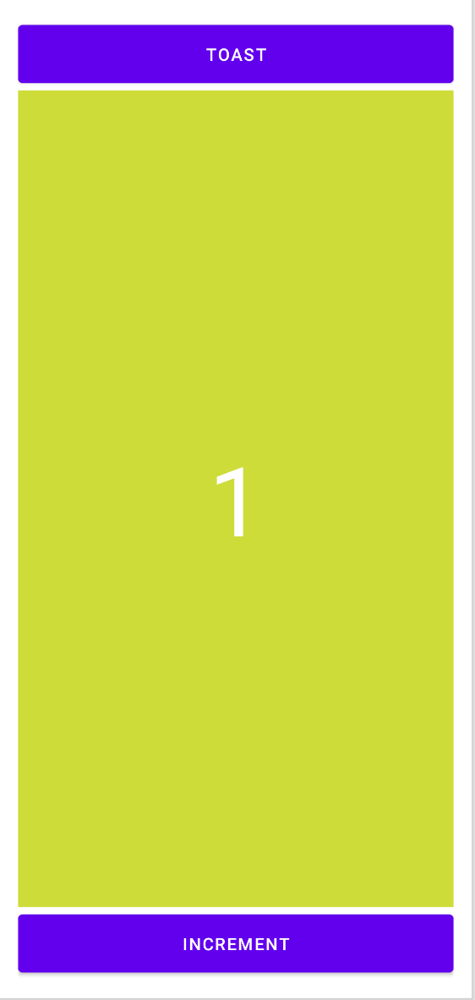

# Les activités et les intentions 
Dans ce TP, nous allons expérimenté l'usage des vues dans une application Android. 

Pour cela, nous allons developper une application disposant de deux boutons et un champ de texte : 
- Le premier bouton permet d'incrémenter un compteur
- Le second permet d'afficher dans un toast le nombre de cliques sur le premier bouton. 

## 1. Créer une application
- Créez un nouveau projet : TPO1_NOM_PRENOM

> Assurez-vous d'avoir selectionné Java dans l'option language

- Suivez les instructions pour compléter la création du projet 

- Choisissez le template **Empty Activity**

- Laissez le nom de l'activité (MainActivity) ainsi que le layout (main_activity)

- Utilisez votre email (inversé) comme nom de package


## 2. Modifiez la vue (activity_main)
- Allez dans le dossier **res > layout** puis cliquez sur le fichier **activity_main**
- Modifiez le layout pour produire un design similaire à l'image suivante 



## 3. Traitez les actions 
On va modifier le code de l'activité afin de récupérer l'instance des vues du layout 

- Modifiez la classe de l'activité pour y ajouter des variables qui représentent les instances des vues du layout
    - 
  **Button** dans la classe **MainActivity**
```Java
    public class MainActivity extends AppCompatActivity {
    
    private Button buttonToast;
    private Button buttonInc;
    private TextView textViewCount;

    ...
}
```

- Ajoutez une méthode permettant d'instancier les variables

```Java
   /**
     * Methods that allow to retrieve the instance of views in the layout
     */
    private void initViews() {
        buttonToast = findViewById(R.id.toast);
        buttonInc = findViewById(R.id.increment);
        textViewCount = findViewById(R.id.textCounter);
    }
}
```
> La méthode ```findViewById``` permet de récupérer l'instance d'un élément de vue connaissant son id.

- Appelez la méthode ```initViews``` dans la méthode onCreate de l'activité. 


- Interceptez l'événement click du bouton. 
Modifiez la méthode ```initViews``` pour intercepter le clique de l'utilisateur sur les 2 boutons. En effet, quand un utilisateur intéragit avec un élément de vue, le système notifie l'application. 
Pour intercepter ces actions, le SDK propose un ensemble de méthodes permettant à l'application d'intercepter ces évènements. 

```Java
    // Intercept click on the compute button
    buttonInc.setOnClickListener(new View.OnClickListener() {
        @Override
        public void onClick(View view) {
            //incrémenter la valeur du compteur puis mettre à jour le text 
            textViewCount.setText(""+counter)
        }
    });

```

> Un toast est un message qui apparait tout en bas de l'écran et disparait automatiquement au bout de quelques secondes. 

```Java
// Pour afficher un toast
Toast.makeText(MainActivity.this, "Click", Toast.LENGTH_SHORT).show();
```

