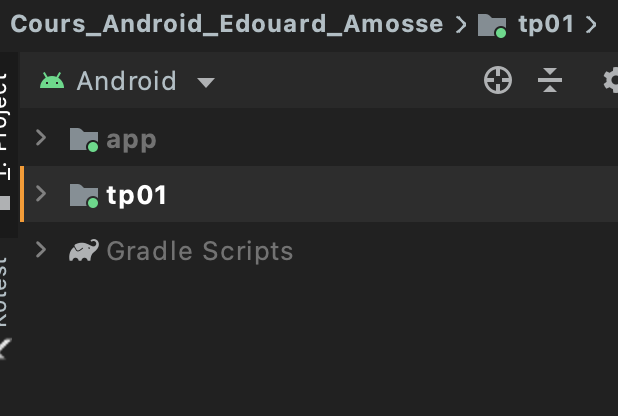

# Expérimenter les modules d'application 

Dans ce TP, nous allons expérimenter la modularité dans un projet Android. Pour cela, nous allons créer une projet dans lequel nous regrouperons les applications développées dans les TPs précédents. 

# 1. Créer un nouveau projet 
 - Créer un nouveau projet Android [Cours_Android_Nom_Prenom]
 - Synchroniser le projet avec git. 

# 2. Modifier le design
Modifier le layout de l'acticité principale pour y ajouter 5 boutons: 
1. Un bouton permettant de lancer le TP01
2. Un bouton permettant de lancer le TP02 
3. Un un bouton permettant de lancer le TP03 
4. Un bouton permettant de lancer le Tp05
5. Commitez les changements sur git

# 3. Ajouter un nouveau module
Créer un nouveau module d'application dans le projet. 
Pour créer un nouveau module faire :

1. File > New > New Module
2. Dans la fenêtre qui s'affiche, choisir Phone et Tablet, puis next
3. Nommer le module : TP01
4. Assurez-vous que le nom de package soit unique
5. Choisir No Activity puis finish
6. Commitez les changements

# 4. Comprendre l'architecture du projet 
Cette manipulation a ajouté un nouveau module d'applications au projet. Désormais, vous avez deux applications dans le même projet.

Dans l'arborescence du projet, un nouveau dossier (module) s'affiche. Ce dossier, contient les sources du nouveau module ou de la nouvelle application. 



Pour compiler, il ne suffit pas de cliquer uniquement sur le bouton ```Exécutez```, il faudra en plus choisir l'application qu'on veut exécuter.

Par défaut, Android séléctionne le dernier module ajouté comme application par défaut, mais vous pouvez le changer en cliquant sur le selecteur d'applications dans la barre d'action. 


# 4. Modifier les sources du tp01
Pour l'instant le module tp01 est vide, dans cette section nous allons recopier les sources du projet [TP01_Nom_Prenom] dans le module du tp01. 

Pour cela, copier les dossier du dossier app du projet [TP01_Nom_Prenom] dans le module tp01 du projet [Cours_Android_Nom_Prenom].

- Copier les fichiers des dossiers suivants : java, res ainsi que AndroidManifest. 

- Une façon simple de copier les fichers java et les coller directement dans pacage principale du module to01 dans Android Sudio.

- Repéter l'opération pourles dossiers res et le fichier Manifest.

- Compiler l'application tp01 et assurez-vous qu'elle fonctionne correctement. 

- Commiter les changements sur git

# 5. Copier les autres applications
Il existe une façon plus simple de copier des modules d'un projet à l'autre. En effet, il suffit de copier tout le dossier du module origine dans le projet destination. 

1. Dans l'explorateur de fichier, ouvrez le projet [TP02_Nom_Prenom] et copiez le dossier app à la racine du dossier [Cours_Android_Nom_Prenom] (toujours dans l'explorateur). 

2. Changer le nom du dossier en ```tp02```

3. Dans Android Studio, ouvrez le fichier ```settings.gradle```pour inclure les sources du module ```tp02``` au projet. 
```gradle
include ':app'
include ':tp01'
include ':tp02'
rootProject.name = "Cours_Android_Edouard_Amosse"
```

4. Compiler le module ```tp02``` et vérifier que l'application fonctionne correctement. 

5. Commitez les derniers changements avant de continuer

6. Répéter les étapes 1 à 5 pours les tps 3 et 4. 

# 6. Rendre le TP
- Commiter et publier les changements sur git
- Ajouter le lien du repo dans le tableau 5 du document partagé
https://docs.google.com/document/d/1h9u-2l4cDpLj28KG4njrYGjATxv4sTGbcVDBAS-1D00/edit


